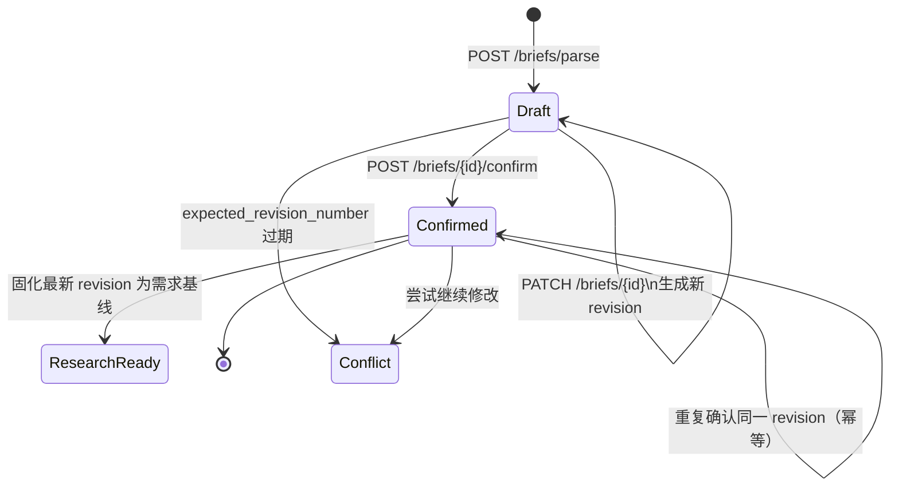

# 运营简报流程 API

运营简报流程把自然语言场景转换为可追溯、可修订、可确认的需求基线。只有最新且已确认的修订版本才能创建报告任务；确认后原简报不能再被覆盖。

## 输入数据边界

接口响应始终包含 `data_boundary`，前端应在用户输入前展示。请勿提交个人身份信息、客户或用户明细、账号密码、API Key 或公司机密。可使用汇总指标、数值区间、匿名分群和非敏感业务描述。

## 状态与版本



`expected_revision_number` 是乐观并发控制字段。客户端必须使用最近一次响应中的版本号；收到 `BRIEF_REVISION_CONFLICT` 后应刷新数据，不得静默覆盖其他修改。

## 1. 登录

```bash
curl -i -c cookies.txt \
  -H "Content-Type: application/json" \
  -d '{"email":"operator@example.com","password":"correct-horse-battery-staple"}' \
  http://localhost:8000/api/v1/auth/register

curl -i -c cookies.txt \
  -H "Content-Type: application/json" \
  -d '{"email":"operator@example.com","password":"correct-horse-battery-staple"}' \
  http://localhost:8000/api/v1/auth/login
```

## 2. 解析自然语言场景

解析接口需要配置 `OPS_AGENT_MODEL_API_KEY`。`Idempotency-Key` 用于安全重放相同创建请求。

```bash
curl -s -b cookies.txt \
  -H "Content-Type: application/json" \
  -H "Idempotency-Key: brief-demo-001" \
  -d '{"scenario":"我们是社区生鲜电商，目标是在未来90天提升新注册家庭用户的次月留存。目前由2名运营负责，希望参考京东和淘宝。"}' \
  http://localhost:8000/api/v1/briefs/parse
```

响应包含：

- `brief`：每个字段的值、状态、来源和原文片段；缺失字段保持 `unknown`。
- `classification`：主要/辅助场景、分类依据和不确定项。
- `required_gaps` 与 `clarifying_questions`：进入研究前需要处理的缺口。
- `revision_number`：后续修改和确认必须携带的版本号。
- `data_boundary`：敏感数据限制与可接受替代形式。

## 3. 补充或修正简报

客户端应提交完整的 `brief` 和 `classification`。用户修正字段使用 `status=user_correction` 对应的领域来源结构，确保后续报告能够追溯变更。

```bash
curl -s -X PATCH -b cookies.txt \
  -H "Content-Type: application/json" \
  -d @brief-revision.json \
  http://localhost:8000/api/v1/briefs/BRIEF_ID
```

`brief-revision.json`：

```json
{
  "expected_revision_number": 1,
  "brief": {
    "business_context": {"value": null, "status": "unknown", "source": "unknown", "source_excerpt": null, "asserted_as_fact": false},
    "current_problem": {"value": "首周关键行为完成率低", "status": "confirmed", "source": "user_correction", "source_excerpt": "首周关键行为完成率低", "asserted_as_fact": true},
    "operation_goal": {"value": "提升次月留存", "status": "confirmed", "source": "user_correction", "source_excerpt": "提升次月留存", "asserted_as_fact": true},
    "target_users": {"value": "新注册家庭用户", "status": "confirmed", "source": "user_correction", "source_excerpt": "新注册家庭用户", "asserted_as_fact": true},
    "business_stage": {"value": "增长期", "status": "confirmed", "source": "user_correction", "source_excerpt": "增长期", "asserted_as_fact": true},
    "execution_period": {"value": "未来90天", "status": "confirmed", "source": "user_correction", "source_excerpt": "未来90天", "asserted_as_fact": true},
    "budget_and_resources": {"value": "2名运营", "status": "confirmed", "source": "user_correction", "source_excerpt": "2名运营", "asserted_as_fact": true},
    "existing_channels": {"value": null, "status": "unknown", "source": "unknown", "source_excerpt": null, "asserted_as_fact": false},
    "current_baseline": {"value": "次月留存15%", "status": "confirmed", "source": "user_correction", "source_excerpt": "次月留存15%", "asserted_as_fact": true},
    "constraints": {"value": null, "status": "unknown", "source": "unknown", "source_excerpt": null, "asserted_as_fact": false},
    "preferred_benchmark_companies": {"value": ["京东", "淘宝"], "status": "confirmed", "source": "user_correction", "source_excerpt": "京东和淘宝", "asserted_as_fact": true}
  },
  "classification": {
    "primary_scene": "retention",
    "secondary_scenes": [],
    "rationale": ["核心目标是提升新注册用户次月留存"],
    "confidence": 1.0,
    "uncertainties": [],
    "user_corrected": true
  }
}
```

## 4. 确认需求基线

```bash
curl -s -X POST -b cookies.txt \
  -H "Content-Type: application/json" \
  -d '{"expected_revision_number":2}' \
  http://localhost:8000/api/v1/briefs/BRIEF_ID/confirm
```

成功后 `status` 为 `confirmed`，`ready_for_research` 为 `true`。系统把该 revision 固化为后续研究与报告使用的需求基线。未确认版本、旧版本或其他用户的版本均不能创建报告任务。

## 稳定错误码

| HTTP | 错误码 | 处理方式 |
| --- | --- | --- |
| 401 | `AUTHENTICATION_REQUIRED` | 重新登录 |
| 404 | `RESOURCE_NOT_FOUND` | 检查 ID；响应不会泄漏其他用户资源是否存在 |
| 409 | `BRIEF_REVISION_CONFLICT` | 刷新后基于最新 revision 重做修改 |
| 409 | `BRIEF_ALREADY_CONFIRMED` | 已确认简报不可覆盖，应创建新的简报流程 |
| 422 | `CRITICAL_BRIEF_GAP` | 补充运营目标或目标用户 |
| 503 | `MODEL_PROVIDER_NOT_CONFIGURED` | 配置模型 Base URL、名称和 API Key |

自动化验收位于 `backend/tests/api/test_brief_workflow.py`，按相同顺序执行“解析—修改—确认”，并覆盖非法状态、版本冲突和输入数据边界提示。
